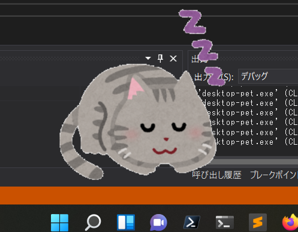

# desktop-pet

windwosのデスクトップ上でアニメーション、音声を再生します。



## 動作

### アニメーション

通常時、ドラック時に異なるアニメーションを再生できます。
pngの透過に対応しています。

### 音声

時報を再生できます。
今後、

- 起動、終了音
- バッテリー等のシステム音
- アラーム
- 定期的な鳴き声、挨拶

を実装する予定です。

## 設定

実行ファイルと同じディレクトリにある

```sh
./preference/preference.json
```

を書くことで好きなようにアニメーション、音声を設定できます。

ソフトの起動中にタスクトレイアイコンを右クリックしpreferenceをクリックすることで設定ファイルを開くことができます。
